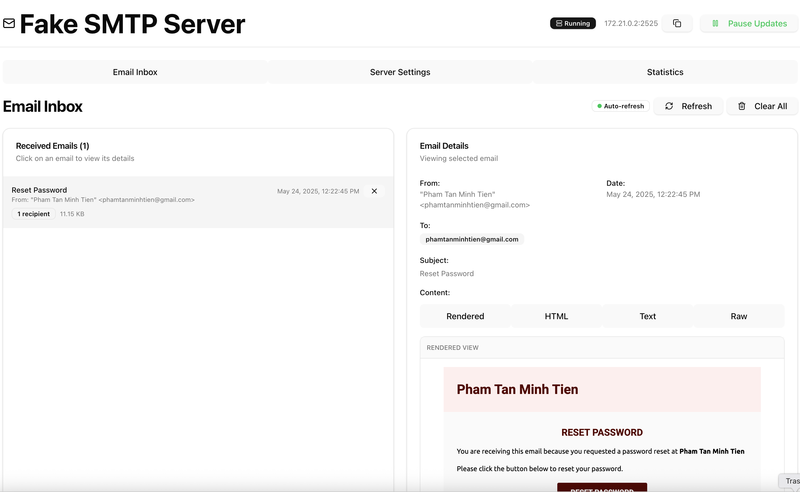

# Fake SMTP Server with UI

A monorepo containing a fake SMTP server with a React frontend and NestJS backend, featuring **TLS certificate upload** for secure email testing.

## Features

✨ **Email Management**

- Receive and display emails via SMTP server
- View email content (HTML, plain text, raw)
- Delete individual emails or clear all
- Real-time email updates with auto-refresh
- Email statistics and analytics

🔒 **TLS Certificate Support**

- **Upload TLS certificates** via web interface
- **Automatic SMTP TLS/STARTTLS configuration**
- Certificate validation and info display
- Real-time certificate status monitoring
- Secure email connections support

🚀 **Modern Tech Stack**

- React frontend with TypeScript and Tailwind CSS
- NestJS backend with Swagger API documentation
- Docker support (single/multi-container deployments)
- Real-time UI updates and modern UX

🔧 **SMTP Server Features**

- Configurable port and authentication
- Automatic network interface detection
- Connection info display and copy-to-clipboard
- Configuration examples for popular email clients
- TLS/STARTTLS support when certificates are uploaded

## Screenshot


_Main interface showing the email list and management features_



_Detailed view of received emails with content inspection_

## TLS Certificate Upload

The server now supports **TLS certificate upload** for secure email connections:

### Features

- **Web-based certificate upload** - Upload `.crt`, `.pem` certificate and `.key` private key files
- **Automatic SMTP configuration** - Server automatically configures TLS/STARTTLS when certificates are available
- **Certificate validation** - Validates certificate format and key compatibility
- **Real-time status** - View certificate details, validity dates, and status
- **Certificate management** - Delete certificates and refresh status

### Usage

1. **Navigate to Settings** - Go to the "Server Settings" tab in the web interface
2. **Upload Certificate** - Scroll to "TLS Certificate Upload" section
3. **Select Files** - Choose your certificate file (.crt/.pem) and private key file (.key/.pem)
4. **Upload** - Click "Upload Certificate" to enable TLS
5. **Verify Status** - Check "Current Certificate Status" for details

### Supported Formats

- **Certificate files**: `.crt`, `.pem`, `.cert`
- **Private key files**: `.key`, `.pem`
- **Certificate types**: X.509 certificates (self-signed or CA-issued)

### SMTP Configuration with TLS

Once a certificate is uploaded, the SMTP server will support:

- **STARTTLS** - Opportunistic TLS encryption
- **Port 2525** - Non-secure initially, upgrades to TLS via STARTTLS
- **Connection security** - Clients can use `requireTLS: true` in configurations

Example nodemailer configuration with TLS:

```javascript
{
  host: 'localhost',
  port: 2525,
  secure: false,        // Use STARTTLS instead of implicit TLS
  requireTLS: true,     // Require TLS upgrade via STARTTLS
  auth: {
    user: 'testuser',   // If authentication is enabled
    pass: 'testpass'
  }
}
```

### API Endpoints

The TLS functionality adds these new API endpoints:

- `GET /api/tls/info` - Get current certificate information
- `POST /api/tls/upload` - Upload certificate and key files
- `DELETE /api/tls/certificate` - Delete current certificate
- `GET /api/smtp/connection-info` - Get SMTP info (now includes TLS status)

## Docker Setup

This project includes Docker configurations for both development and production environments with three deployment options:

1. **Simple Docker Run** (single command deployment)
2. **Single image setup** (frontend + backend in one container)
3. **Multi-service setup** (frontend + backend in separate containers)

### Prerequisites

- Docker
- Docker Compose (for options 2-3)

## Option 1: Simple Docker Run

For quick testing and simple deployments using the pre-built image:

```bash
# Run directly with docker
docker run -d \
  --name fake-smtp-server \
  --restart unless-stopped \
  -p 80:80 \
  -p 2525:2525 \
  phamtanminhtien/fake-smtp-server:latest

# View logs
docker logs fake-smtp-server

# Stop container
docker stop fake-smtp-server

# Remove container
docker rm fake-smtp-server
```

This will:

- Use the pre-built image `phamtanminhtien/fake-smtp-server:latest` from Docker Hub
- Run the container in detached mode
- Map port 80 for the web interface
- Map port 2525 for SMTP server
- Auto-restart on failure
- Minimal setup required

## Option 2: Single Image Setup

For deployment with docker-compose using either pre-built or locally built image:

### Using Pre-built Image (Recommended)

```bash
# Pull and start the pre-built image
docker-compose -f docker-compose.single.yml up -d

# Or pull manually first
docker pull phamtanminhtien/fake-smtp-server:latest
docker-compose -f docker-compose.single.yml up -d
```

### Building Locally

```bash
# Build and start single unified image
docker-compose -f docker-compose.single.yml up --build

# Run in detached mode
docker-compose -f docker-compose.single.yml up -d --build

# Or use the helper script
./docker.sh single
```

This will:

- Serve frontend via nginx on port 80
- Run backend on internal port 3000
- SMTP server available on port 2525
- Proxy API calls from `/api/` to the backend
- Use supervisor to manage both processes
- Include health checks and auto-restart

## Option 3: Multi-Service Setup

### Production Build

To build and run the application in production mode:

```bash
# Build and start all services
docker-compose up --build

# Run in detached mode
docker-compose up -d --build
```

This will:

- Build the backend (NestJS) application and serve it on port 3000
- Build the frontend (React) application and serve it via nginx on port 80
- Set up networking between the services

### Development Build

For development with hot reloading:

```bash
# Build and start in development mode
docker-compose -f docker-compose.yml -f docker-compose.override.yml up --build

# Or simply (docker-compose automatically uses override file)
docker-compose up --build
```

This will:

- Start the backend with hot reloading on port 3000
- Start the frontend with Vite dev server on port 5173
- Mount source code volumes for live editing

### Available Services

**Simple Docker Run (Option 1):**

- **Frontend**: http://localhost
- **Backend API**: http://localhost/api
- **SMTP Server**: localhost:2525

**Single image setup (Option 2):**

- **Frontend**: http://localhost
- **Backend API**: http://localhost/api
- **SMTP Server**: localhost:2525

**Multi-service setup (Option 3):**

- **Frontend**: http://localhost (production) or http://localhost:5173 (development)
- **Backend API**: http://localhost:3000/api (proxied through frontend in production)
- **SMTP Server**: localhost:2525

### Docker Commands

#### Docker run commands (Option 1 - Simple):

```bash
# Start container
docker run -d --name fake-smtp-server --restart unless-stopped -p 80:80 -p 2525:2525 phamtanminhtien/fake-smtp-server:latest

# View logs
docker logs fake-smtp-server

# Follow logs
docker logs -f fake-smtp-server

# Stop and remove
docker stop fake-smtp-server && docker rm fake-smtp-server

# Restart container
docker restart fake-smtp-server
```

#### Single image commands (Option 2):

```bash
# Using pre-built image (recommended)
docker-compose -f docker-compose.single.yml up -d

# Pull latest image
docker pull phamtanminhtien/fake-smtp-server:latest

# Build locally
docker-compose -f docker-compose.single.yml up --build

# Stop service
docker-compose -f docker-compose.single.yml down

# View logs
docker-compose -f docker-compose.single.yml logs
```

#### Multi-service commands (Option 3):

```bash
# Build images
docker-compose build

# Start services
docker-compose up

# Stop services
docker-compose down

# View logs
docker-compose logs

# Rebuild and start
docker-compose up --build

# Remove all containers and volumes
docker-compose down -v
```

#### Helper script commands:

```bash
# Multi-service
./docker.sh build    # Build images
./docker.sh up       # Start production
./docker.sh dev      # Start development
./docker.sh down     # Stop services
./docker.sh logs     # View logs

# Single image
./docker.sh single     # Build and start unified image
./docker.sh single-dev # Build and start unified image (attached)
./docker.sh single-down # Stop unified image
./docker.sh single-logs # View unified image logs
```

### Architecture

**Single image setup (Options 1 & 2):**

- **Combined Image**: Both frontend and backend in one container using multi-stage build
- **Frontend**: React + Vite app built and served by nginx on port 80
- **Backend**: NestJS app running on port 3000 (internal) with built TypeScript
- **SMTP Server**: Available on port 2525 for email testing
- **Process Management**: Supervisor manages both nginx and Node.js processes
- **Reverse Proxy**: Nginx proxies `/api/` requests to internal backend
- **Health Checks**: Built-in health monitoring with `/app/healthcheck.sh`
- **Security**: Uses Alpine Linux base image and optimized for production
- **File Persistence**: Email data saved to `/data` directory (gitignored)

**Multi-service setup (Option 3):**

- **Backend Container**:
  - NestJS application with multi-stage build (base, development, build, production)
  - Node.js 18 Alpine base image for smaller size
  - Exposes ports 3000 (API) and 2525 (SMTP)
  - Non-root user (nestjs:1001) for security
  - Production dependencies only in final stage
  - Built TypeScript application in `/dist` directory
  - Health check support with wget
- **Frontend Container**:
  - React + Vite application with multi-stage build
  - Served by nginx in production
  - Custom nginx configuration for SPA routing
  - Health check support with curl
  - Static assets optimized for production
- **Networking**: Services communicate via Docker network
- **Development**: Hot reloading support with volume mounts
- **Security**: Non-root users in production containers

### File Structure

```
├── packages/
│   ├── backend/
│   │   ├── Dockerfile              # Multi-stage backend Dockerfile (dev/build/prod)
│   │   ├── src/                    # Backend source code
│   │   └── data/                   # Email data storage (gitignored)
│   └── frontend/
│       ├── Dockerfile              # Multi-stage frontend Dockerfile (dev/build/prod)
│       ├── nginx.conf              # Frontend nginx config for production
│       └── src/                    # Frontend source code
├── Dockerfile                      # Single unified image (frontend + backend)
├── docker-compose.yml              # Multi-service production setup
├── docker-compose.override.yml     # Multi-service development overrides
├── docker-compose.single.yml       # Single image deployment (uses Docker Hub)
├── docker.sh                       # Helper script for all Docker operations
├── nginx-single.conf               # Nginx config for unified image
├── supervisord.conf                # Process manager config for unified image
├── start.sh                        # Startup script for unified image
├── healthcheck.sh                  # Health check script
└── .dockerignore                   # Docker build ignore patterns
```

### Docker Build Features

**Backend Dockerfile (`packages/backend/Dockerfile`):**

- **Multi-stage build**: Optimized for different environments (development, build, production)
- **Security**: Non-root user (nestjs:1001) in production stage
- **Health checks**: wget installed for container health monitoring
- **Port exposure**: 3000 (API) and 2525 (SMTP server)
- **Dependency optimization**: Production-only dependencies in final stage
- **Alpine Linux**: Smaller image size and better security

**Frontend Dockerfile (`packages/frontend/Dockerfile`):**

- **Multi-stage build**: Development, build, and nginx production stages
- **SPA support**: Custom nginx configuration for React Router
- **Health checks**: curl installed for monitoring
- **Static optimization**: Built assets served efficiently by nginx

**Unified Dockerfile (`Dockerfile`):**

- **Combined build**: Builds both frontend and backend in single image
- **Process management**: Supervisor coordinates nginx and Node.js
- **Reverse proxy**: Nginx handles routing and API proxying
- **Health monitoring**: Comprehensive health check script

### When to Use Which Setup

**Use Simple Docker Run (Option 1) when:**

- You need quick testing or demos
- You want minimal setup with single command
- You don't need docker-compose features
- You're running on systems without docker-compose
- You prefer direct Docker commands
- You want instant deployment with pre-built image

**Use Single image setup (Option 2) when:**

- You want simpler deployment with docker-compose
- You have resource constraints
- You need everything in one container
- You're deploying to platforms that prefer single containers
- You want both pre-built and local build options
- You need health checks and restart policies

**Use Multi-service setup (Option 3) when:**

- You need to scale frontend and backend independently
- You want to deploy services separately
- You need development hot reloading
- You prefer microservices architecture
- You want to build from source locally
- You need to customize the build process

## Configuration

### Environment Variables

The server can be configured using the following environment variables:

**SMTP Configuration:**

- `SMTP_PORT` - SMTP server port (default: 2525)
- `SMTP_HOST` - SMTP server hostname (auto-detected if not set)
- `SMTP_FAKE_USER` - Username for SMTP authentication (optional)
- `SMTP_FAKE_PASS` - Password for SMTP authentication (optional)

**Example with authentication:**

```bash
# Docker run with authentication
docker run -d \
  --name fake-smtp-server \
  -p 80:80 -p 2525:2525 \
  -e SMTP_FAKE_USER=testuser \
  -e SMTP_FAKE_PASS=testpass \
  phamtanminhtien/fake-smtp-server:latest

# Docker compose environment
services:
  fake-smtp:
    image: phamtanminhtien/fake-smtp-server:latest
    environment:
      SMTP_PORT: 2525
      SMTP_FAKE_USER: testuser
      SMTP_FAKE_PASS: testpass
    ports:
      - "80:80"
      - "2525:2525"
```

### Data Persistence

**Email Data:**

- Stored in `/data/emails` directory
- Persisted across container restarts
- Can be mounted as volume for persistence

**TLS Certificates:**

- Stored in `/data/certificates` directory
- Automatically loaded on server startup
- Includes certificate metadata and validation info
- Persisted across container restarts

**Volume mounting example:**

```bash
# Persistent data storage
docker run -d \
  --name fake-smtp-server \
  -p 80:80 -p 2525:2525 \
  -v /host/data:/data \
  phamtanminhtien/fake-smtp-server:latest
```

### TLS Certificate Management

**Storage Location:**

- Certificates: `/data/certificates/cert.pem`
- Private keys: `/data/certificates/key.pem`
- Metadata: `/data/certificates/metadata.json`

**Certificate Requirements:**

- Must be valid X.509 certificates
- Private key must match the certificate
- Supports both self-signed and CA-issued certificates
- PEM format required

**Security Notes:**

- Certificates are validated on upload
- Private keys are stored securely on the filesystem
- TLS context is tested before activation
- Invalid certificates are rejected with detailed error messages

### Local Development

**Prerequisites:**

- Node.js 18+
- npm or yarn
- Git

**Setup:**

```bash
# Clone repository
git clone <repository-url>
cd fake-smtp-server

# Install dependencies
npm install

# Install backend dependencies
cd packages/backend
npm install

# Install frontend dependencies
cd ../frontend
npm install

# Return to root
cd ../..
```

**Development commands:**

```bash
# Start backend development server
cd packages/backend
npm run start:dev

# Start frontend development server (in new terminal)
cd packages/frontend
npm run dev

# Build for production
npm run build
```

**Environment setup for development:**
Create `.env` file in `packages/backend/`:

```env
SMTP_PORT=2525
SMTP_HOST=localhost
SMTP_FAKE_USER=testuser
SMTP_FAKE_PASS=testpass
```

## License

This project is licensed under the MIT License - see the [LICENSE](LICENSE) file for details.

This means you are free to use, copy, modify, merge, publish, distribute, sublicense, and/or sell copies of the software without any restrictions.
